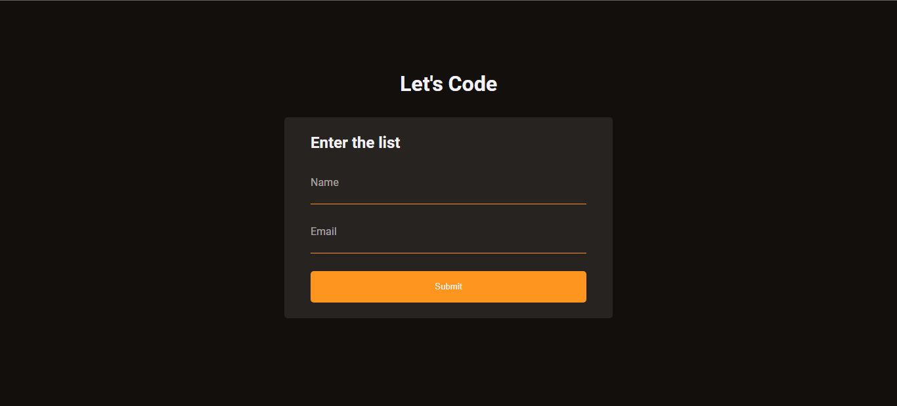
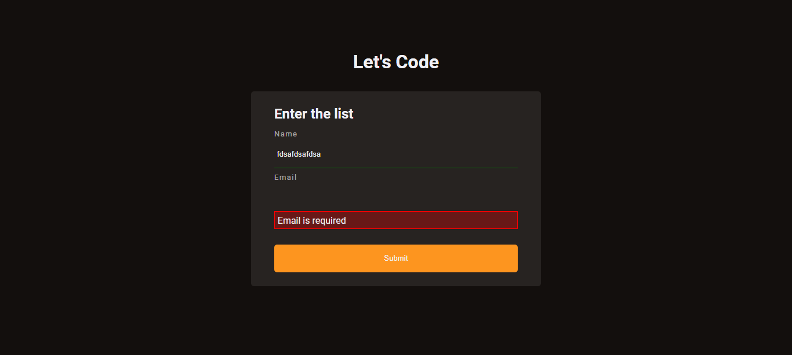
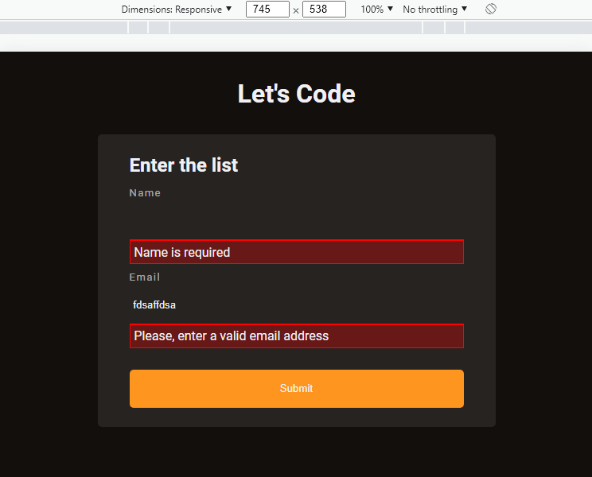
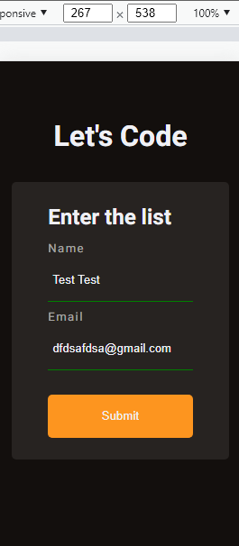

    
    
    
    

<h1 align='center'>Form Validation in JS</h1>

Custom Form Validation using HTML, CSS, JS and Validation API 

    • <a href='#about-the-project'>About the project</a>  •
    <a href='#screenshots'>Screenshots</a>  •
    <a href='#how-to-use'>How to Use</a>  •
    <a href='#features'>Features</a>  •
    <a href='#how-to-contribute'>How to Contribuite</a>  •
    <a href='#author'>Author</a>  •
    <a href='#license'>Licence</a>    

🚀Project Completed ✅ 

## 💻 About the Project

This project consists of a simple form page and it is designed to practice validating forms in javascript using the forms api. The project was developed based on a [Rocket Seat Youtube video](https://www.youtube.com/watch?v=GTMEuHxh8aQ) but with some changes.

## 🎨 Screenshots

### Desktop / Laptop 

### Mobile 

## 🚀 How to Use

Before you start, you will need to install [Git](https://git-scm.com/) and also a powerful code editor like [Visual Studio Code](https://code.visualstudio.com/) to clone, test and modify this repository on your machine. To understand the code, you need to know the basics of HTML, CSS and JavaScript. 
## 🛠 Features

The following tools were used in the construction of the project:

### Languages 
- [HTML5](https://developer.mozilla.org/pt-BR/docs/Web/HTML)
- [CSS3](https://developer.mozilla.org/pt-BR/docs/Web/CSS)
- [JavaScript](https://www.javascript.com/) 

### Utilities
- [Web Form API](https://www.w3schools.com/js/js_validation_api.asp)

## 💪 How to Contribuite
1. Fork the project.

2. Create a new branch with your changes: `git checkout -b my-feature` 

3. Save the changes and create a commit message telling you what you've done: `git commit -m "feature: My new feature"`

4. Submit your changes: `git push origin my-feature`

## 🦸 Author
Made with ❤️ by Gustavo Souza. 👋 [Get in touch](https://www.linkedin.com/in/gustavo-victor-575b93206/)

- GitHub - [@Gustavo-Victor](https://github.com/Gustavo-Victor)
- Frontend Mentor - [@Gustavo-Victor](https://www.frontendmentor.io/profile/Gustavo-Victor)
- CodePen - [@gustavo_victor](https://codepen.io/gustavo_victor)
- Linkedin - [@gustavo-victor](https://www.linkedin.com/in/gustavo-victor-575b93206/)

## 📝 Licence 
This project is under the [MIT license](./LICENSE).

Anyone can use, clone, fork and contribute to this project.

